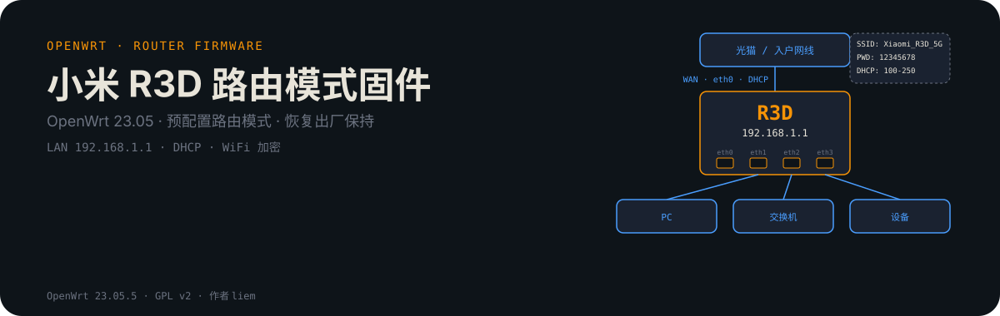
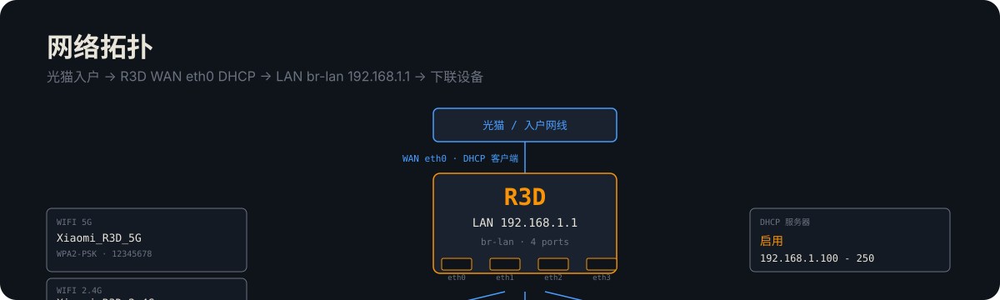
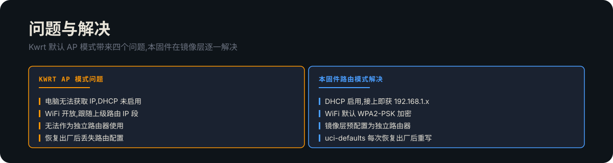
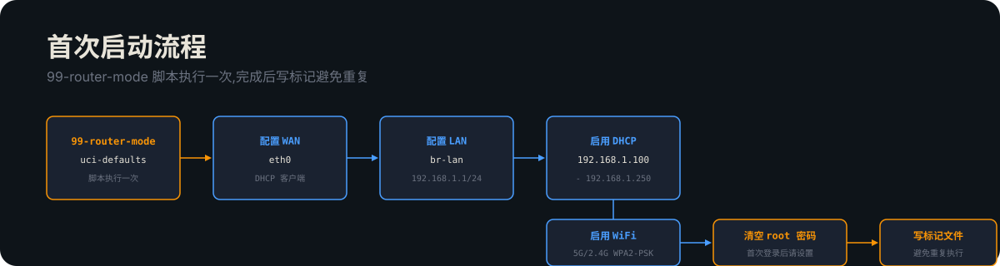
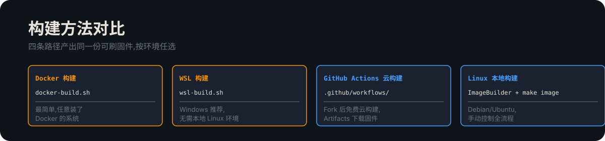
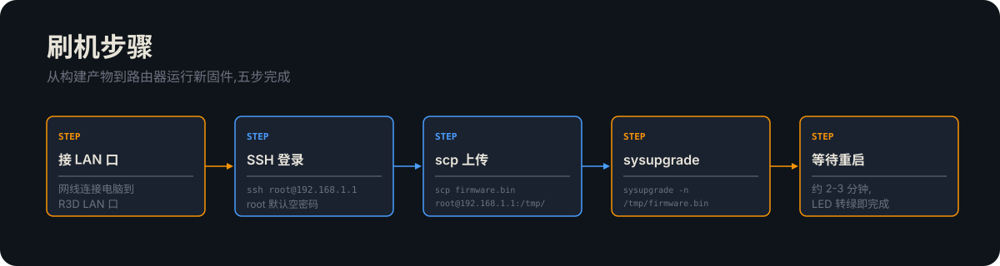

## 网络拓扑



小米 R3D 出厂刷入 Kwrt 后默认以 AP 模式(旁路由)启动。本固件在镜像构建阶段预配置为路由模式,首次启动即为独立路由器,恢复出厂后仍保持。

### 默认配置

| 项 | 值 |
| --- | --- |
| LAN IP | 192.168.1.1 |
| WAN | eth0,DHCP 客户端 |
| DHCP 服务器 | 启用,192.168.1.100 - 192.168.1.250 |
| WiFi 5G SSID | Xiaomi_R3D_5G |
| WiFi 2.4G SSID | Xiaomi_R3D_2.4G |
| WiFi 密码 | 12345678(WPA2-PSK) |
| 管理密码 | 空(首次登录后请设置) |
| NTP | ntp.aliyun.com / time1.cloud.tencent.com |

## 问题与解决



Kwrt 默认 AP 模式带来四个问题:电脑无法获取 IP、WiFi 开放且跟随上级路由 IP、无法作为独立路由器使用、恢复出厂后丢失路由配置。本固件在镜像层逐一解决。

## 工作原理

### 配置文件结构


镜像构建阶段把 `network` / `firewall` / `dhcp` 配置和 `uci-defaults/99-router-mode` 首次启动脚本一起打包进固件。首次启动即路由模式,不是 AP 模式。

### 首次启动流程



`r3d_router_config/etc/uci-defaults/99-router-mode` 在系统首次启动或恢复出厂后执行一次。脚本写完配置后写入标记文件 `/etc/.r3d_router_mode_done`,已配置则跳过,避免重复执行。

| 路径 | 作用 |
| --- | --- |
| `r3d_router_config/etc/config/network` | WAN eth0 DHCP / LAN br-lan 192.168.1.1 |
| `r3d_router_config/etc/config/firewall` | NAT 启用 / LAN→WAN 允许 |
| `r3d_router_config/etc/config/dhcp` | DHCP 服务器启用 |
| `r3d_router_config/etc/uci-defaults/99-router-mode` | 首次启动自动配置路由模式 |

## 构建方法




### Docker 构建(最简单)

```bash
sh docker-build.sh
```

### WSL 构建(Windows 推荐)

```bash
sh wsl-build.sh
```

### GitHub Actions 云构建

1. Fork 本仓库
2. 进入仓库 Actions 页
3. 选择对应 workflow
4. Run workflow
5. 构建完成后在 Artifacts 下载固件

### Linux 本地构建

```bash
sudo apt install build-essential libncurses-dev libssl-dev
# 下载 OpenWrt ImageBuilder
# 复制 r3d_router_config/ 到 ImageBuilder 目录
make image
```

## 刷机步骤



1. 网线连接电脑到 R3D LAN 口
2. SSH 登录路由器:
   ```bash
   ssh root@192.168.1.1
   ```
3. 上传固件:
   ```bash
   scp firmware.bin root@192.168.1.1:/tmp/
   ```
4. 刷机(`-n` 不保留旧配置):
   ```bash
   sysupgrade -n /tmp/firmware.bin
   ```
5. 等待重启完成,约 2-3 分钟

### 系统内升级

```bash
cd /tmp
wget http://your-server/firmware.bin
sysupgrade -n firmware.bin
```

### 修复已刷入的 Kwrt 固件

若已刷入 AP 模式的 Kwrt,无需重刷固件,用快速修复脚本:

```bash
scp fix_r3d_router_mode.sh root@192.168.1.1:/tmp/
ssh root@192.168.1.1 'sh /tmp/fix_r3d_router_mode.sh'
```

## 故障排除

| 现象 | 原因 | 解决 |
| --- | --- | --- |
| 电脑无法获取 IP | DHCP 未启用 / 接错 WAN 口 | 确认网线接 LAN 口,检查 DHCP 服务 |
| 无法访问 192.168.1.1 | 电脑 IP 不在同段 | 手动设静态 IP 192.168.1.x |
| 无法上网 | WAN 未获取地址 | 检查光猫到 R3D WAN 口网线 |
| WiFi 无法连接 | 密码错误 | 默认密码 12345678 |
| SSH 连接失败 | root 密码已改 | 恢复出厂后默认空密码 |
| 恢复出厂后变 AP 模式 | 未使用本固件 | 刷入本固件或运行修复脚本 |

## 安全建议

- 设 root 密码:`passwd`
- 修改 WiFi 密码(默认 12345678 仅为占位)
- 启用 HTTPS 管理

## 技术支持

- [OpenWrt 官方文档](https://openwrt.org/docs/start)
- [OpenWrt 中文文档](https://openwrt.org/zh/docs/start)
- [恩山无线论坛](https://www.right.com.cn/forum/)
- [GitHub Issues](https://github.com/liem0352/xiaomi-r3d-router-firmware/issues)

## License

GPL v2,基于 OpenWrt。

## 致谢

- [OpenWrt](https://openwrt.org/)
- Kwrt
- 恩山论坛


